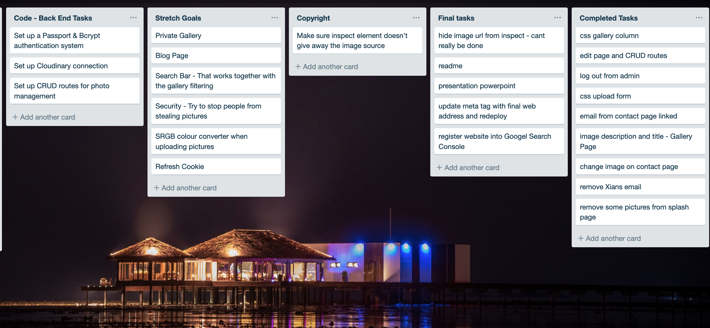

<h1>Mern Stack Assignment</h1>
<h2>Links</h2>

<h3><a href="https://www.imagistic.now.sh">imagistic.now.sh</a></h3>

<h3><a href="https://github.com/YongBong946/Imagistic-be">GitHub Repo</a></h3>

----

Required stack: 

>Mongo
- MongoDB is a scalable document model database, stored in JSON format, which allows for real time indexing and querying.

>Express
- A lightweight framework that helps the architecture of your application to follow MVC structure.

>React js 

- A javascript library built by facebook, for fast build UI interface with scalability by creating reusable UI components.

>Node js
- A runtime environment that allows javascript to be run outside a browser.
---
*A brief tour through the Imagistic site as a visitor*

 


*Imagistic site as an admin* <br/>


---
  <h2>Project</h2> 
  Building a working website for professional photographer Dave Sumner to showcase his Portfolio.
  The application required a dashboard page with access control for the client to update and maintain his gallery and photos.

<h2>Features of this application</h2>

1. Upon loading the page, visitors are brought to a splash page, featuring some of our client's work which transitions every five seconds or upon click.
2. Our client is able to showcase his photography in a gallery.
3. Visitors are able to sort through the gallery via the sidebar, which houses our album and tags filtering system.
4. Visitors are able to get in touch with our client via the contact page.
5. Visitors can read about our client in an About page.
6. Client is able to upload, edit, and manage the photo gallery from a secure admin dashboard.

<h2>Getting Started</h2>
===
This is a MERN stack project, and therefore will require MongoDB, Express, React, and NodeJs.

<h3>Dependencies and Packages</h3>
Packages used in this projects are listed in package.json.
You will need to run the following snippet in your terminal :

 ```bash 
 $npm install

 ```
---
<h2>Problems We Encountered</h2>

>Data Schema 
- Allowing schema relations between photos, albums, and tags. It was hard to decide on a particular data structure because we were not sure what site functionalities we were capable of producing in three weeks and what David himself wanted.

>Naming Conventions
- Repeated ID's and classNames became a problem when tackling CSS. We had forms with slight variations for uploading and editing, reusing the same code meant that some elements were inheriting CSS from the other page.

>Passport Session 
- Cookies were not appearing in the browser on inspect, but the session was still in place and was live for the assigned amount of time.

>Deployment
- We wanted to change the front end now.sh alias URL. After changing the URL, the images in the gallery was no longer loading.
  
>Copyright Concerns
- Our client is very concerned with the copyright and the legal usage of his photos. We were not sure there was much we can do about this because if they're determined enough, there's not much you can do to deter theft on the internet.
---

<h3>Solutions</h3>

>Data Schema 
- Setting a schema with an array of albums, and tags in the imageSchema. This allows both albums and tags to be related, without having to do a separate schema for each component.

>Naming conventions 
- We found refactoring code helps, in cleaning up the names within the divs on each page, to eliminate repeats, and to reflect better. 

>Passport Session
- We found that CORS was blocking the cookies. Setting defaults on CORS to send with credentials solved the problem.
  
>Deployment 
- Whitelist URL in adblocker and enable cookies in privacy badger.

>Copyright Concerns
- To help protect the client's IP, we disabled all right clicks on images. There are still ways around this but we thought this little deterrent would discourage most average visitors.
---
<h2>USER STORIES</h2>
<h3>As a Photographer</h3>

- I want a website that can host my photos, allowing public to view them, sort through them by albums and tags.
- I want to be able to edit, upload, and delete my images through a secure channel.
  
<h3>As a Visitor</h3>

- I want to be able to sort through the gallery easily so that I can find photos that I am looking for.
- I want to be able to look at an individual image and see a brief description.
- I want to be able to read a bit about the photographer himself so that I can understand his work better.
- I want to be able to contact the photographer so that I can commission/ask him quesiton.
---
<h2>Wireframes</h2>

  *Figma*
  

---
<h2>MongoDB Object Data Modeling Diagram</h2>

  ```json
userSchema = new mongoose.Schema({
  username: {
    type: String,
    required: true
  },
  password: String
});
```
***


```json
imageSchema = new mongoose.Schema({
  title: {
    type: String,
    required: true
  },
  image: {
    type: String,
    required: true
  },
  description: {
    type: String,
    required: true
  },
  timestamp: {
    type: Date,
    default: Date.now
  },
  album: [{
      type: String,
      required: true
    }],
  tags: [{
      type: String,
      required: true
  }]
});
  ```
  ***

<h2>Project Plan and Timeline</h2>
A 3 weeks long project which started on Jan 21, and end in Feb 7, 2019.

*Project TimeLine*


*User Flow Chart*


*Data Flow Diagram*


*App Tree Structure*


*Trello*



*Client Communications*

**Tools**
Trello, Github, Agile methodologies, Code Review
Demonstrate your project management skills, Client meeting minutes, and other communication tools

---
<h1>Short Answer Questions</h1>

<h2>What are the most important aspects of quality software?</h2>
There is no one most important aspect. Quality software or applications rely on their interconnecting functions, the application architecture, and performance. This allows the software itself to be maintained, scaled, and improved over time. This fosters a healthy relationship between users and the development team and this connection kepps the software at optimum level.

<h2>What libraries are being used in the app and why?</h2>
Front End packages :

- "axios": "^0.18.0"
A request based library used to perform http requests. It takes care of the data transformation to JSON. It is promise based, offers better error handling and has cross site forgery protection.

- "react": "^16.7.0"
A flexible library that builds user interface based on components set on how and what to render. Using a virtual DOM to run data that gets displayed on your page without refreshing.

- "react-router-dom": "^4.3.1"
A React routing library.

Back End packages :

- "bcrypt": "^3.0.3"
A program that hashes passwords by incorporating "salt", data used as part of the hashing results in a stronger,more complex hash to protect the password.<br/>

- "cloudinary": "^1.13.2"
A package developed by Cloudinary integrating access between API to its cloud server. Cloudinary is a platform that hosts media files.

- "concurrently": "^4.1.0"
A package that lets you run multiple scripts concurrently in development stages by combining back end and front end.

- "cookie-session": "^2.0.0-beta.3"
A package that allows you to create a cookie that stores user credentials in temporary local storage with the ability to set time to auto destroy, or when browser is closed.

- "cors": "^2.8.5">
Cross-Origin Resource Sharing, a package that allows it's user to set up access control to allow communication between 2 or more domains into your API.

- "dotenv": "^6.2.0"
A stand alone module that loads environment variables, allowing user to set password and other sensitive information on a separate file, that can be hidden away from the code. This flow is based on the twelve factor app methodology.

- "express": "^4.16.4"
A light-weight framework that preps your app with MVC architecture.

- "mongoose": "^5.4.5"
A MongoDB relationship manager between data, runs a schema validation.

- "multer": "^1.4.1"
A middleware that helps upload files.

- "passport": "^0.4.0"
An authentication middleware

- "passport-local": "^1.0.0"
A local authentication middleware

<h2>A team is about to engage in a project, developing a website for a small business. What knowledge and skills would they need in order to develop the project?</h2>

- Understanding client "User Stories" and a good understanding on what the client is currently using, versus expectations with the allowed time frame and budget.
- Adopting Agile methodology in aiding the team to complete the project in timely and healthy manner.
- Task assignment within the team to allow function separation in accordance to the project priority to allow completion within time frame.

<h2>Within your own project what knowledge or skills were required to complete your project, and overcome challenges?</h2>

- Standups :
This allows focus and direction within the team.
- Planning, wireframing, designing in figma, and updates in trello.
- Go outside your comfort zone. Ask colleaques, teachers or even rubber ducking when facing road blocks.


<h2>Evaluate how effective your knowledge and skills were this project, using examples, and suggest changes or improvements for future projects of a similar nature?</h2>

- Having to complete the first 6 months within Coder Academy, this time as a team, we felt that we are more prepared conceptually, and able to have a better understanding on how to approach certain task on hand. The course has also made us become a better "googler". 

- Agile methodology is a powerful tool that everyone should be holding on to. It is definitely a tool that is worth looking deeper into to understand how it can be applied once we are in the workforce.

- Implementing private galleries: so the client can take on clients of his own and host images in a private gallery for private perusing. 

- Implementing mass upload: at the moment we only have the ability to upload one image at a time. Mass upload would be useful feature to have. 

***


